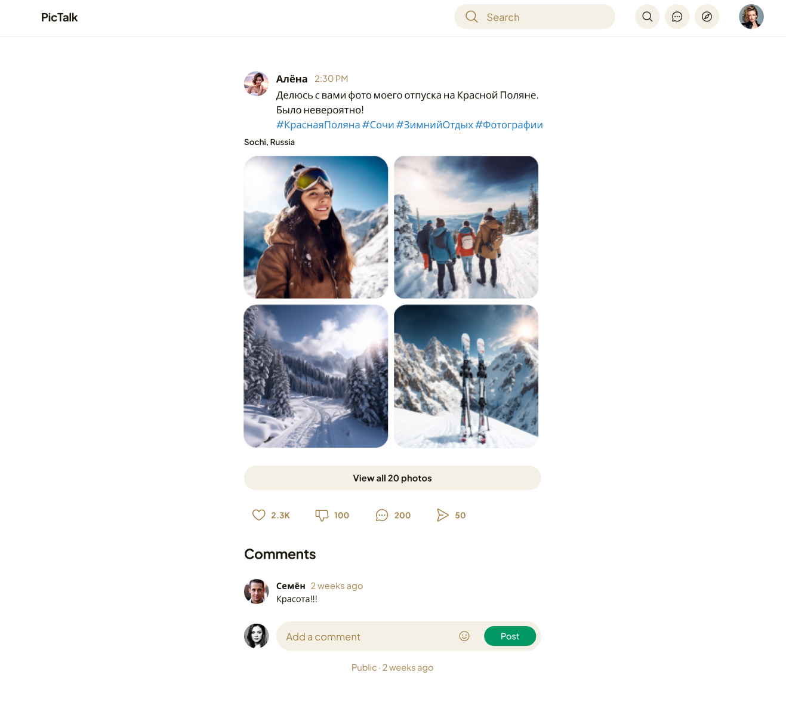

# Дипломная работа профессии «Python-разработчик с нуля»


## Backend приложение для социальной сети для обмена фотографиями

В качестве дипломной работы разработано API для загрузки публикаций (постов) с изображениями, с возможностью комментировать посты и ставить лайки.

Прототип фронтенда приложения на скрине:




### Реализация

Посты состоят из текста, фотографий и времени создания поста.

Просматривать посты и комментарии к постам могут все пользователи, в том числе и не авторизованные.

Публикации могут создаваться только авторизованными пользователями, редактировать, 
удалять публикацию может только её автор.

Комментарии могут быть написаны к определённой публикации, оставлять их могут только авторизованные 
пользователи, редактировать, удалять комментарий может только его автор.
Сам комментарий состоит из текста и даты его публикации.

Помимо комментариев, авторизованные пользователи также могут оставлять реакцию на публикацию в виде лайка, 
а так же убирать свой лайк с публикации.

В публикации помимо полей самой публикации отображается список комментариев и количество 
лайков к публикации, например:

```json
{
  "id": 1,
  "text": "Новый прекрасный день",
  "image": "/posts/image1.jpg",
  "created_at": "2024-02-23T02:24:29.338414",
  "comments": [
    {
      "author": 2,
      "text": "Круто",
      "created_at": "2024-02-23T05:12:31.054234"
    }
  ],
  "likes_count": 20
}
```

### Инструкция по запуску проекта

Для запуска проекта необходимо

* установить зависимости:
```python
pip install -r requirements.txt
```
* необходимо создать базу в postgresql и применить миграции:
```python
manage.py migrate
```
* при создании моделей или их изменении необходимо выполнить следующие команды:
```python
python manage.py makemigrations
python manage.py migrate
```
*  для создании superuser необходимо выполнить следующую команду:
```python
python manage.py createsuperuser
```
* команда для запуска приложения:
```python
python manage.py runserver
```
* для создания пользователей и получения токенов авторизации можно воспользоваться административной панелью.